#  OpenClassrooms - iOS developer path - iOS Project 9
## WakyZzz - Adaptive layout (iPhones and iPads)
## XCTest - User Notification - Core Data

This is an existing alarm app that needs to be fixed and more features added to it in order to function like an alarm. Unit tests have been added along with tests report and "findings and fixex" documentation. 
The app uses local notification to alert the user.
The user can set an alarm for a given time. 
This alarm can go off one time or every selected day of the week. 
The alarms are automatically sorted by time in an ascending order. 
Each alarm can be switched off/on, edited or deleted. 

## Portrait

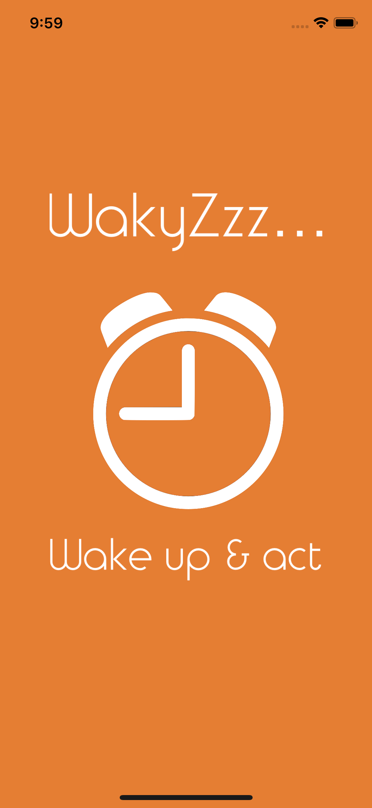

 

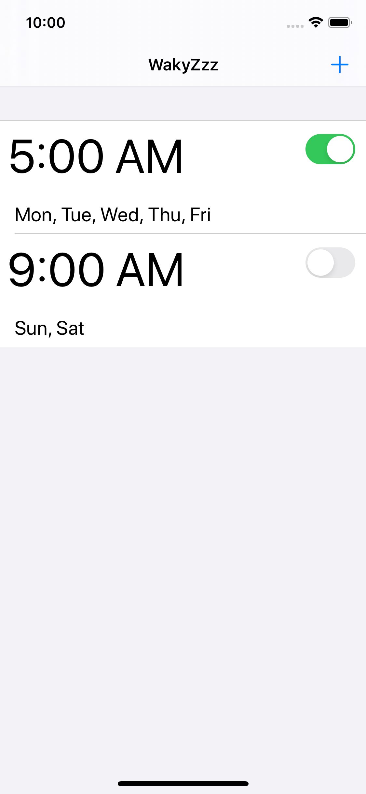
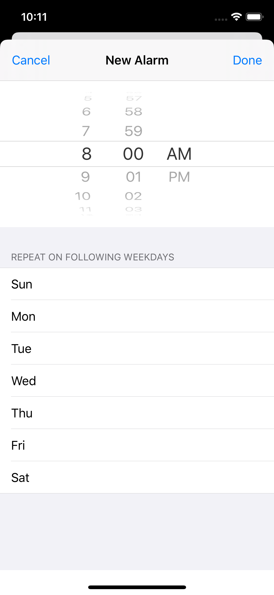

 

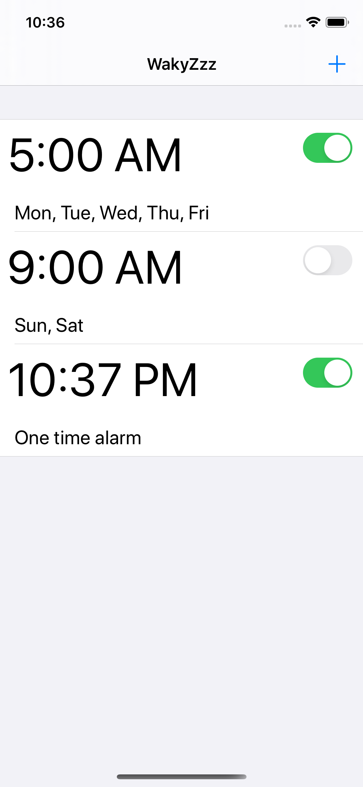
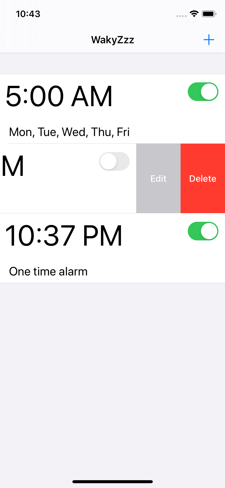

 

When the alarm goes off the user can snooze it. 

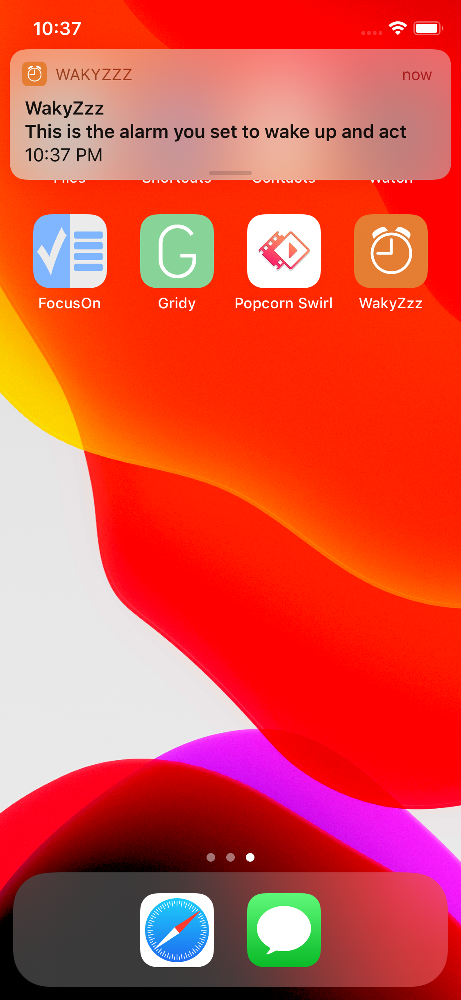
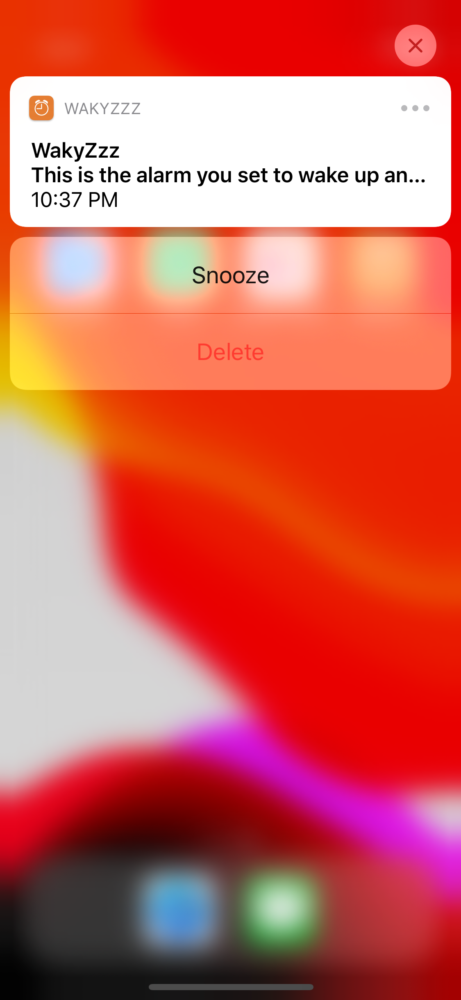

 

If the user chooses to tap on snooze action, the alarm will then go off after one minute but at a noticeably higher sound. 

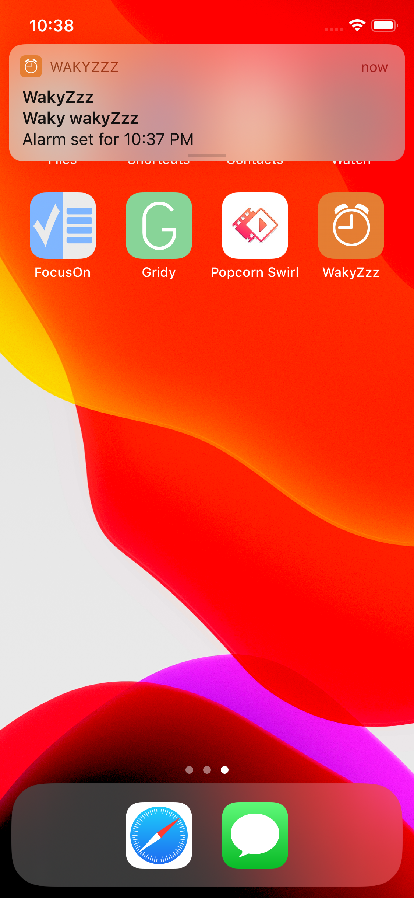
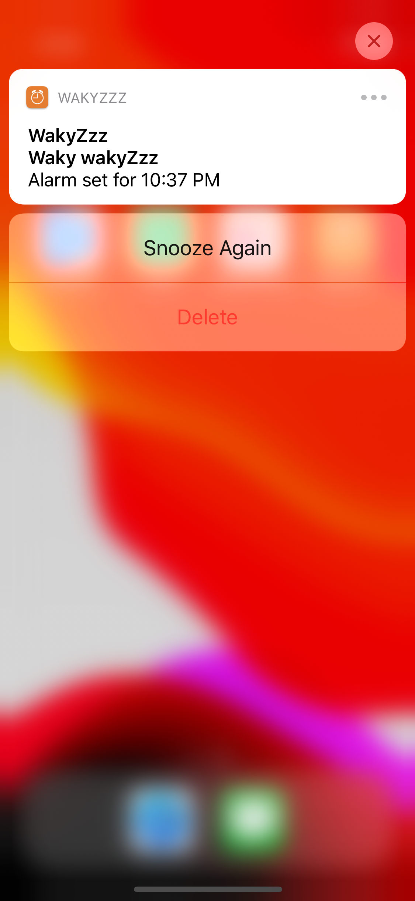

 

If the user chooses to tap on snooze again,  the alarm will then go off again after two to four hours but then a <strong><em>scary</em></strong> sound will be played, and the user will have to do an act of kindness. 

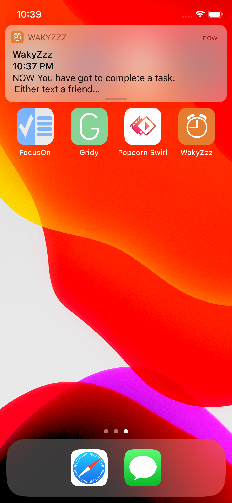
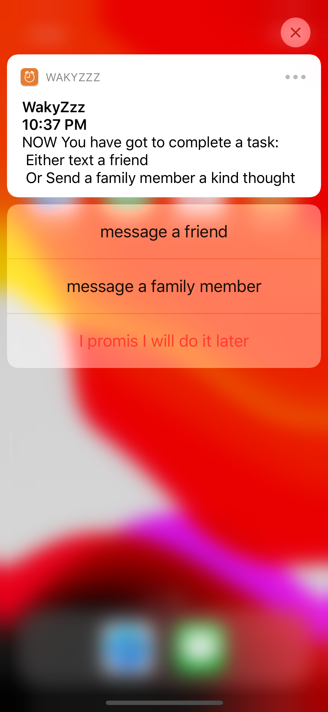

 

When the user tap on either act of kindness' actions, the sms app will launch and it will be filled with a randomly picked pre-compiled kind text.
The user also can delay his/her promise and can be reminded two to four hours later through user notification. 

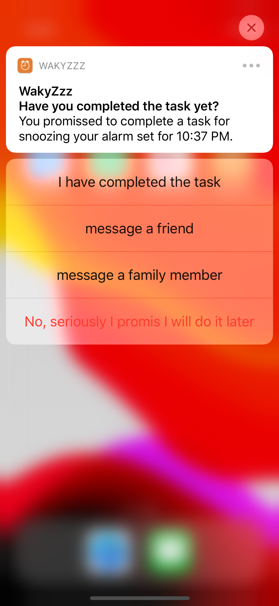

 

## Landscape

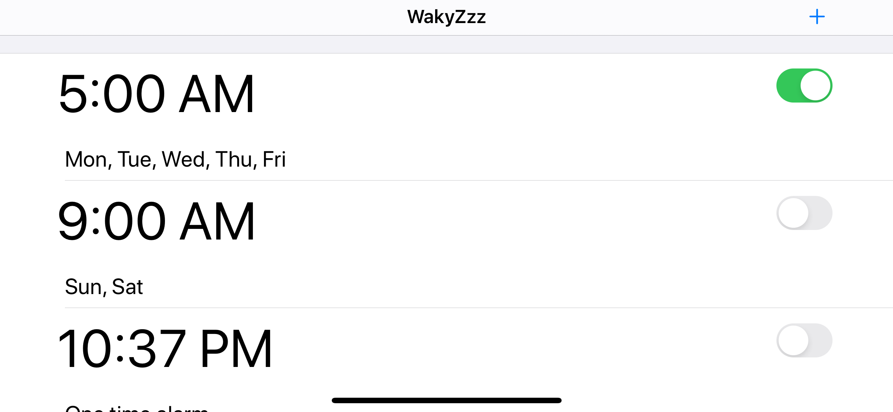

  

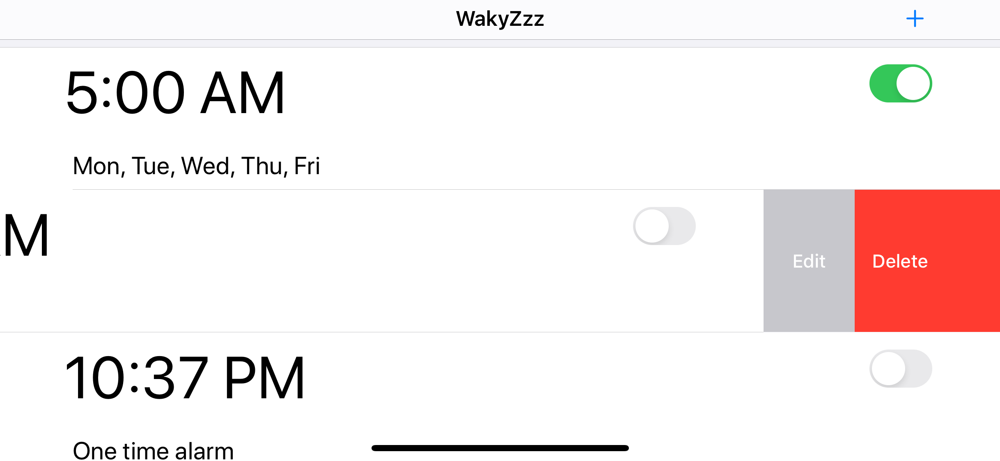

  

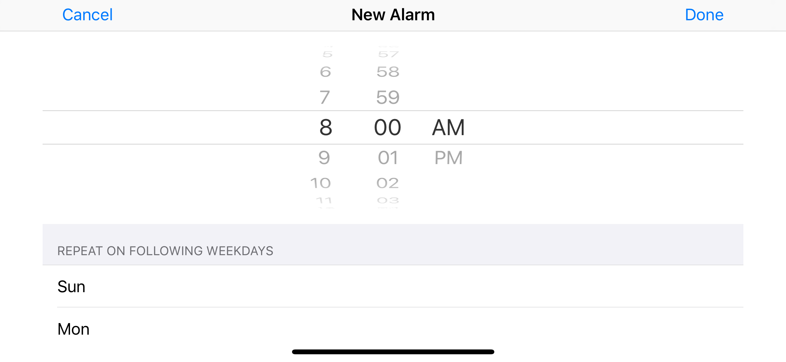

  

